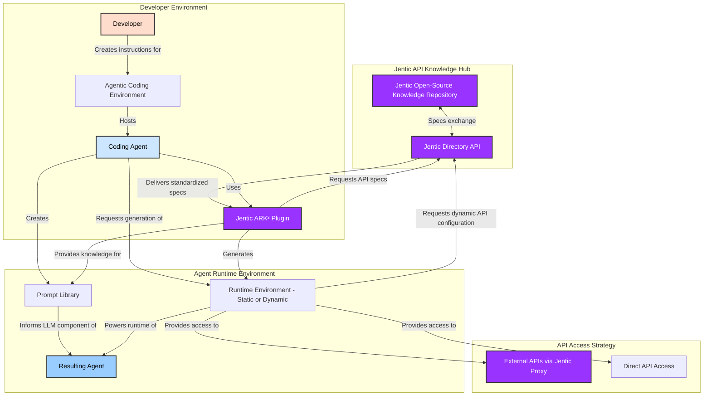

# Jentic Product Architecture

## Introduction

The Jentic infrastructure provides precise API and tool information to Agentic Development Environments, allowing developers to build agents that have broad knowledge of APIs and tools without the developer needing to understand their technical details. At the heart of Jentic is the ARK² (Agentic API Reference and Runtime Knowledge Kit) Plugin, which integrates seamlessly with modern agentic development environments like Windsurf and Claude Code. 

With the emergence of these AI coding environments, agentic development is rapidly becoming the standard approach for building AI agents. In this paradigm, there are two distinct agents involved:
1. The **Coding Agent** within the developer's Agentic Coding Environment (like Cascade in Windsurf) that assists the developer in writing code
2. The **Resulting Agent** that is the output of the development process and will be deployed to users

Jentic anticipates this shift and creates a foundation that seamlessly integrates with these modern development workflows, enabling developers to focus on defining the behavior of their resulting agents while the system handles API integration complexities.

Jentic's architecture is organized into four interconnected components, each serving a specific role in the agent development process:

**Component 1: API Knowledge Hub** provides API specifications in JenSpec format, a common standard containing both LLM-friendly descriptions and execution information. The Jentic Open-Source Knowledge Repository stores these specifications, while the Jentic Directory API manages access to them.

**Component 2: The ARK² Plugin** integrates with developers' preferred agentic development environments (like Windsurf and Claude Code) and agent architectures (such as LangChain, AutoGen, or LlamaIndex). It bridges these environments with the API Knowledge Hub, retrieving JenSpec specifications and generating both LLM-compatible prompts and executable code that allows the resulting AI agents to access APIs and tools without the developer needing to worry about their technical details.

**Component 3: Generated Agent Runtimes** are generated by the ARK² plugin and consist of the Runtime Environment and Prompt Library, which interface with the developer's preferred agent framework and API access methods to enable the resulting agent to interact with external services.

**Component 4: API Access** offers strategies for connecting to external APIs, including External APIs via Jentic Proxy for authentication, secure access, managed access, and operations where a proxy provides a more seamless experience, alongside Direct API Access for trusted services where direct connections are preferred.

## Detailed Architecture

The following diagram illustrates the components of the Jentic Product Architecture and their relationships:

## Component Components and Implementation

The following sections detail each component of the architecture, describing their components and implementation.

### Component 1: API Knowledge Hub

The API Knowledge Hub component contains two key components:

#### Jentic Open-Source Knowledge Repository

The Jentic Open-Source Knowledge Repository maintains JenSpec specifications and serves as the foundational knowledge source for the entire architecture.

**Key Functions:**
- **API Standardization**: Stores JenSpec specifications with endpoints, parameters, auth requirements, and response structures in a consistent format
- **Version Management**: Tracks JenSpec versions and compatibility details to ensure resulting agents work with appropriate API versions
- **Framework Compatibility**: Provides implementation patterns for different frameworks to support cross-framework development
- **Community Contributions**: Enables collaborative maintenance and improvement of JenSpec specifications

JenSpec is designed to provide both LLM-friendly API descriptions and execution information in a common format, making it suitable for both code generation and runtime execution.

#### Jentic Directory API

The Jentic Directory API serves as the interface to the Knowledge Repository, enabling structured access to JenSpec specifications throughout the system.

**Key Functions:**
- **Specification Retrieval**: Provides APIs to fetch JenSpec specifications by name, version, or functionality
- **Search Capabilities**: Enables semantic search across JenSpec specifications to find those matching specific requirements
- **Compatibility Checking**: Assesses compatibility between JenSpec specifications and development frameworks
- **Change Notification**: Alerts dependent systems and/or developers when JenSpec specifications are updated

### Component 2: The ARK² Plugin

The ARK² (Agentic API Reference and Runtime Knowledge Kit) Plugin is designed to seamlessly integrate with modern agentic development environments like Windsurf and Claude Code, enhancing them with access to the Jentic API Knowledge Hub.

**Key Functions:**
- **Tool Specification Generation**: Creates environment-specific tool-use specifications (such as MCP format, OpenAI's function calling schema, or Anthropic's tool use APIs) that allow LLMs to understand and use the APIs in their preferred execution environment. This includes translating JenSpec specifications into format-specific implementation code and reducing specifications to include only the functions or components required by a specific resulting agent
- **Environment Integration**: Plugs into popular agentic coding environments, providing access to JenSpec specifications without disrupting existing workflows
- **Framework Compatibility**: Works with various resulting agent frameworks (LangChain, AutoGen, LlamaIndex, etc.) to support developers' preferences
- **Code Generation**: Produces framework-specific runtime code for accessing external APIs based on developer requests, including the import and integration of API-specific libraries or frameworks required for tool or API access
- **Prompt Engineering**: Creates optimized prompts that teach resulting agents how to properly use the APIs
- **Test Framework Generation**: Creates API test frameworks for resulting agents, ensuring they interact correctly with the specified APIs

**Integration Strategy:**
- Jentic anticipates agentic development environments to become extensible through standard protocols (possibly via Model Configuration Protocol or similar standards)
- Until formal plugin standards emerge, the ARK² Plugin can be implemented as a standalone executable or through environment-specific integration methods
- This flexible approach ensures compatibility with current environments while being ready for future standardization

### Component 3: Generated Agent Runtimes

The Generated Agent Runtimes component contains the artifacts produced by the ARK² Plugin when a developer creates a resulting agent with help from the coding agent. These runtimes integrate with the developer's preferred agent framework and provide the necessary functionality to access external APIs through their preferred access method.

#### Runtime Environment

The Runtime Environment provides the execution framework for the resulting agent, automatically generated by the ARK² Plugin based on the agent's requirements and the developer's preferred framework.

**Key Features:**
- **Framework Compatibility**: Seamlessly integrates with the developer's chosen agent framework (LangChain, AutoGen, LlamaIndex, etc.)
- **API Client Implementation**: Includes optimized client code for each required API, generated from JenSpec specifications
- **Authentication Management**: Implements appropriate authentication mechanisms for each API (API keys, OAuth, JWT, etc.)
- **Error Handling**: Provides robust error detection, reporting, and recovery mechanisms specific to each API
- **Runtime Configuration**: Supports dynamic configuration of API endpoints, credentials, and other parameters
- **Observability**: Includes logging, monitoring, and telemetry capabilities to track API usage and performance

**Evolution of API Integration:**
- **Initial Static Integration**: Early iterations will provide static integration with a set of APIs pre-determined at build time, allowing for stable and reliable performance with known APIs
- **Progressive Dynamic Capabilities**: The architecture is designed to evolve toward dynamic API selection, where resulting agents can discover, configure, and utilize new APIs at runtime without requiring regeneration
- **Hybrid Approach**: As the platform matures, it will support both pre-configured API integrations for mission-critical functions and dynamic integration for extensibility and flexibility
- **Runtime API Discovery**: Future versions will enable resulting agents to autonomously discover and integrate with new APIs based on their capabilities and the agent's needs, expanding functionality without developer intervention

#### Prompt Library

The Prompt Library contains the LLM-specific content that guides the resulting agent's behavior when interacting with APIs, generated in formats compatible with the selected LLM.

**Key Features:**
- **Tool Descriptions**: Provides LLM-readable descriptions of available APIs in the format expected by the specific LLM
- **Few-Shot Examples**: Includes examples demonstrating correct API usage and parameter combinations
- **Error Recovery Patterns**: Contains guidance for handling common API errors and exceptional conditions
- **Context Management**: Helps the LLM maintain relevant context when making API calls and interpreting responses
- **Output Formatting**: Defines templates for presenting API responses to users in a consistent, readable format

### Component 4: API Access

The API Access component manages how resulting agents interact with external services, providing different strategies based on security, performance, and integration requirements:

#### External APIs via Jentic Proxy

The Jentic Proxy provides a secure intermediary between resulting agents and external APIs, offering enhanced management capabilities.

**Key Functions:**
- **Authentication Handling**: Manages API keys and credentials centrally to enhance security
- **Rate Limiting**: Prevents excessive API usage and ensures compliance with service quotas
- **Usage Monitoring**: Tracks API calls for billing, analytics, and optimization
- **Error Normalization**: Standardizes error responses across different APIs
- **Request Validation**: Verifies requests before sending them to external services
- **Response Caching**: Caches responses to improve performance and reduce API costs

#### Direct API Access

Direct API access provides a direct connection to APIs without intermediaries, typically for internal or trusted services.

**Key Functions:**
- **Performance Optimization**: Eliminates proxy overhead for faster response times
- **Credential Management**: Integrates directly with credential storage mechanisms
- **Custom Error Handling**: Implements API-specific error handling and recovery
- **Specialized Integration**: Supports deep integration with service-specific features
- **Reduced Latency**: Minimizes network hops for time-sensitive operations

#### Hybrid Approach

The hybrid approach combines proxy and direct access methods within a single resulting agent.

**Key Functions:**
- **Strategy Selection**: Dynamically chooses the appropriate access method for each API
- **Security Balancing**: Uses proxied access for sensitive operations and direct access for performance
- **Fallback Mechanisms**: Switches between methods if one fails or becomes unavailable
- **Configuration Management**: Provides centralized control over access policies
- **Adaptability**: Adjusts strategies based on runtime conditions and requirements